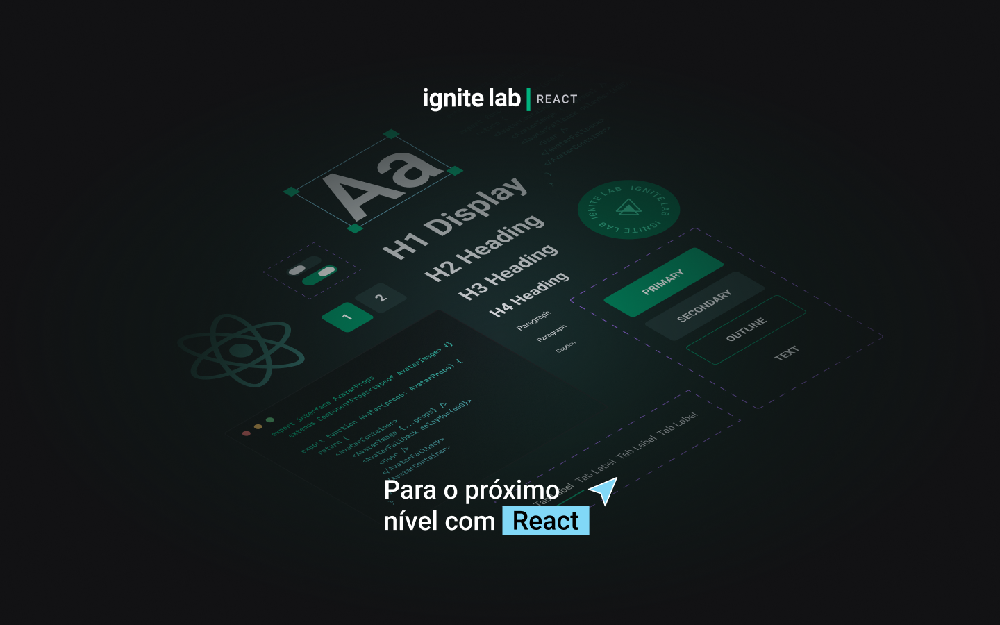
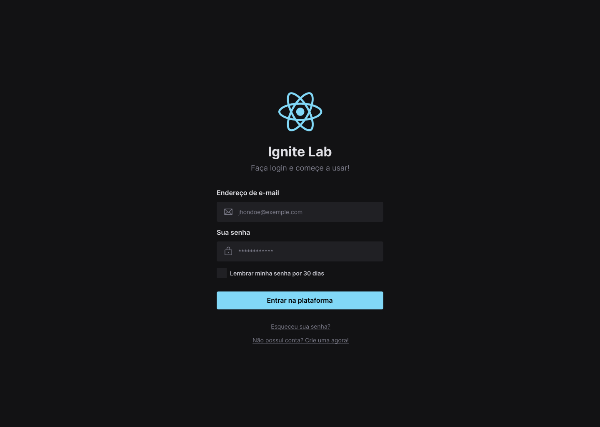
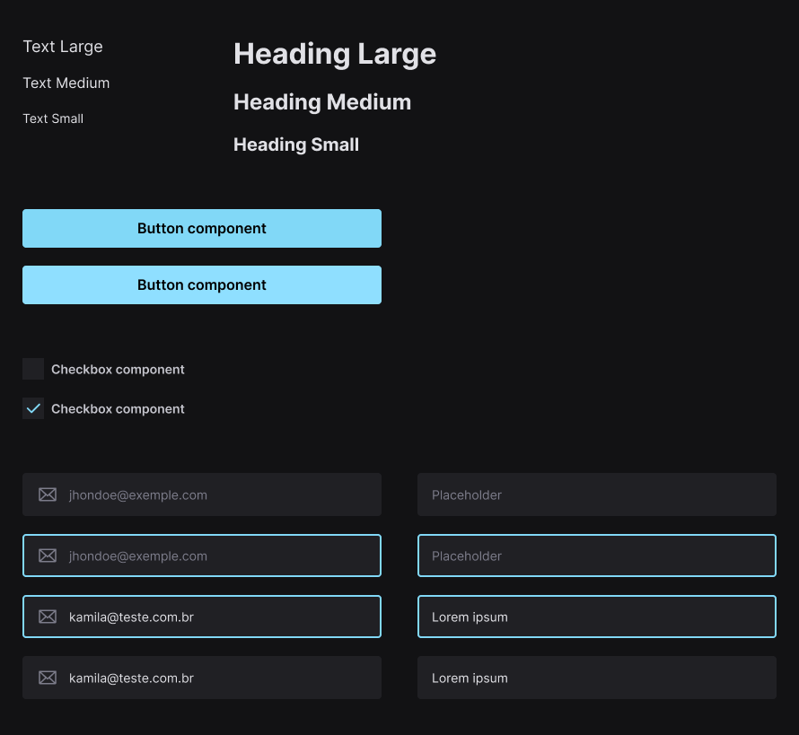
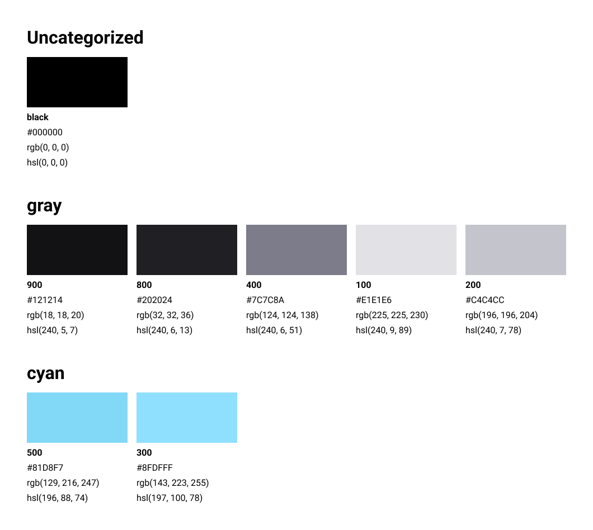

## Ignite Lab - Design System

Projeto de design system no Figma e com Storybook no React desenvolvido durante o evento do Ignite Lab da @Rocketseat 💜 :rocket:

### Sobre o projeto

O projeto consiste numa tela de login com o layout e design systems feitos no Figma, e o desenvolvimento da aplicação com Storybook, React e Typescript. Este projeto visa apresentar técnicas de desenvolvimento de design systems no layout bem como a composição de design systems na aplicação web com Storybook.

### O projeto no Figma

#### Layout

#### Componentes - Design System

#### Cores

### Como rodar a aplicação?

**1.** Clone este repositório com o seguinte comando:

`git clone git@github.com:Kamila-Vieira/design-system.git`

**2.** Você vai precisar ter o **Node.js** instalado na sua máquina.

> [Como instalar o Node.js](https://nodejs.org/en/). 

**3.** Instale as dependências do projeto com o comando:

`npm install`

**4.** Rode a aplicação com o comando:

`npm run dev`

**5.** Para a visualização do design system no Storybook rode o seguinte comando:

`npm run storybook`

 **Isto é tudo! :heart: 
Se você tiver dúvidas sobre o design system, você pode perguntar no [GitHub Issues](https://github.com/Kamila-Vieira/design-system/issues).**